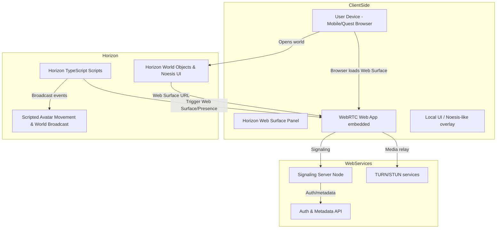

# AaireelXR — Horizon Video Presence

**All rights assigned fully to the project owner (Deepak Raut).**

## Project Overview

AaireelXR — Horizon Video Presence is a production-ready solution that enables immersive video presence experiences within Meta Horizon Worlds. By embedding a WebRTC-powered web application inside Horizon's Web Surface feature, users can engage in real-time video calls while maintaining their virtual presence in the Horizon environment.

## Key Features

- 🎥 **Real-time Video Calls**: WebRTC-based video communication optimized for Web Surface embedding
- 🌐 **Horizon Integration**: TypeScript scripts and Noesis UI templates for seamless in-world integration
- 🔒 **Secure Signaling**: JWT-authenticated signaling server with TURN/STUN support
- 📱 **Mobile-Optimized**: Responsive UI designed for Quest and mobile browsers
- ✨ **Holographic Avatars**: Semi-transparent holograms with anti-gravity bobbing and rotation
- 🎭 **Emotion Broadcasting**: 4-button emotion system (Heart, Smile, Laugh, Sad) with particle effects
- 🤖 **AI NPC Guide**: GenAI-powered virtual assistant for onboarding and help
- 👥 **Multi-User Sync**: Real-time emotion and presence synchronization across all players
- 🧪 **Fully Tested**: Comprehensive unit and E2E test coverage

## Architecture



## Repository Structure

```
/
├── web-rtc-client/          # React + Vite WebRTC client
├── signaling-server/        # Node.js WebSocket signaling server
├── backend/                 # Auth and metadata API
├── horizon-scripts/         # Horizon World TypeScript scripts
│   ├── noesis-ui-templates/ # Noesis UI XML templates
│   └── horizon-tests/       # Unit tests for Horizon logic
├── docs/                    # Complete documentation
├── infra/                   # Deployment infrastructure
├── scripts/                 # Setup and utility scripts
└── .github/workflows/       # CI/CD pipelines
```

## Quick Start

### Prerequisites

- Node.js 18+ (LTS recommended)
- npm or pnpm
- Docker (optional, for containerized deployment)
- Git with SSH key configured

### Local Development

1. **Clone the repository**
   ```bash
   git clone git@github.com:rauttech/aireelxr-meta-horizon.git
   cd aireelxr-meta-horizon
   ```

2. **Start the signaling server**
   ```bash
   cd signaling-server
   npm install
   npm run dev
   ```

3. **Start the web client**
   ```bash
   cd web-rtc-client
   npm install
   npm run dev
   ```

4. **Access the application**
   - Web Client: http://localhost:5173
   - Signaling Server: http://localhost:3001

For detailed setup instructions, see [docs/local-setup-mac.md](docs/local-setup-mac.md).

## Testing

```bash
# Run all unit tests
npm test

# Run E2E tests
cd web-rtc-client
npm run test:e2e

# Run tests with coverage
npm run test:coverage
```

## Production Deployment

See [docs/production-deploy.md](docs/production-deploy.md) for complete deployment instructions covering:
- Vercel/Netlify deployment for web client
- DigitalOcean/Azure deployment for signaling server
- TURN server setup and configuration
- Environment variables and secrets management

## Horizon World Integration

To integrate this solution into your Horizon World:

1. Deploy the web client and signaling server to production
2. Follow the step-by-step guide in [docs/horizon-import-guide.md](docs/horizon-import-guide.md)
3. Copy the TypeScript scripts from `horizon-scripts/` into Horizon Editor
4. Import Noesis UI templates from `horizon-scripts/noesis-ui-templates/`
5. Configure Web Surface with your deployed web client URL

## Documentation

- [Architecture Overview](docs/architecture.md)
- [Local Development Setup (Mac)](docs/local-setup-mac.md)
- [Production Deployment Guide](docs/production-deploy.md)
- [Horizon Editor Import Guide](docs/horizon-import-guide.md)

## Security & Privacy

- JWT-based authentication with short-lived tokens
- SRTP encryption for media streams
- Secure WebSocket connections (WSS)
- TURN server with credential rotation
- GDPR-compliant data handling

## License

MIT License - See [LICENSE](LICENSE) file for details.

**All rights assigned fully to the project owner (Deepak Raut).**

## Contributing

This is a proprietary project. All contributions and intellectual property belong to Deepak Raut.

## Support

For issues or questions, please refer to the documentation in the `docs/` directory.

