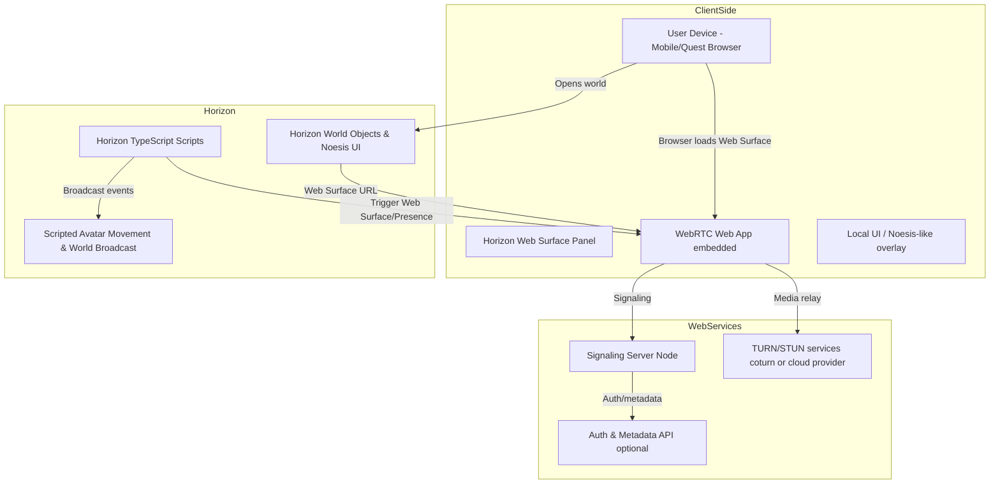
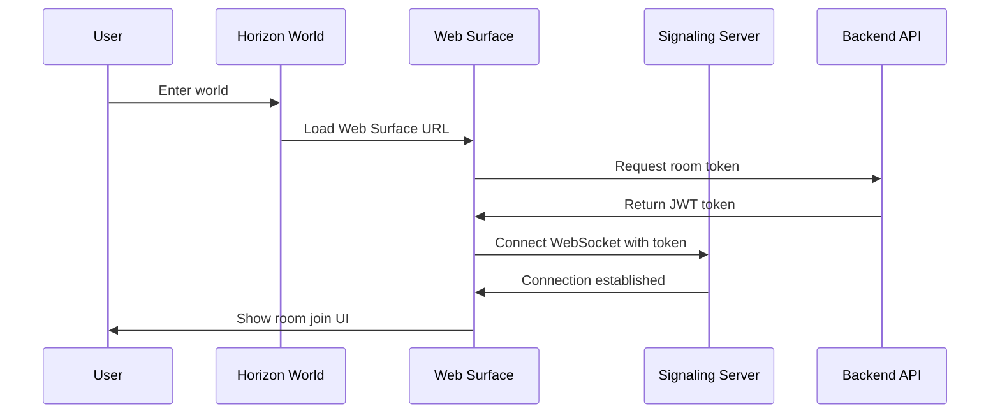
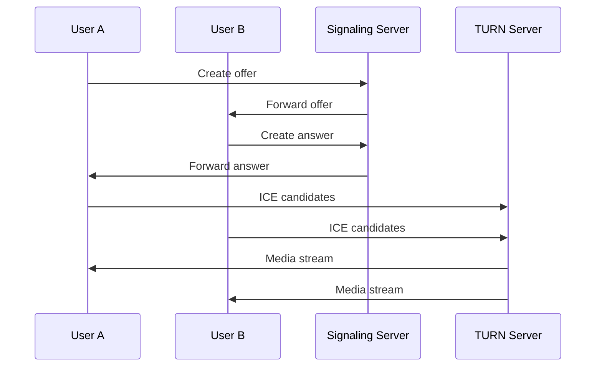

# Architecture Overview

## System Architecture

AaireelXR — Horizon Video Presence is a distributed system that enables real-time video communication within Meta Horizon Worlds through Web Surface integration.

## High-Level Architecture



## Component Details

### 1. WebRTC Client (`/web-rtc-client`)

**Technology**: React + Vite + TypeScript

**Responsibilities**:
- Render video call UI optimized for Web Surface embedding
- Manage WebRTC peer connections
- Handle media capture (camera/microphone)
- Communicate with signaling server via WebSocket
- Support URL parameters for room joining from Horizon

**Key Modules**:
- `ConnectionManager`: WebRTC connection lifecycle management
- `RoomJoin`: Room creation and joining UI
- `PresenceMode`: In-call presence controls
- `VideoGrid`: Responsive video layout

### 2. Signaling Server (`/signaling-server`)

**Technology**: Node.js + Express + Socket.IO + TypeScript

**Responsibilities**:
- WebSocket-based signaling for WebRTC offer/answer/ICE
- JWT authentication and token validation
- Room lifecycle management
- TURN/STUN server configuration distribution

**Key Modules**:
- `RoomManager`: Room state and participant tracking
- `AuthMiddleware`: JWT validation
- `TURNConfig`: TURN/STUN server credentials

### 3. Backend API (`/backend`)

**Technology**: Node.js + Express + TypeScript

**Responsibilities**:
- User authentication and session management
- Room metadata storage (MongoDB)
- Optional: Recording metadata and memory storage

**Endpoints**:
- `POST /auth/token`: Generate JWT for room access
- `POST /rooms`: Create new room
- `GET /rooms/:id`: Get room metadata

### 4. Horizon Scripts (`/horizon-scripts`)

**Technology**: TypeScript (Horizon Script API)

**Responsibilities**:
- Spawn and configure Web Surface objects
- Handle in-world UI interactions
- Trigger avatar movements for presence modes
- Broadcast events to all players

**Key Scripts**:
- `horizon-match-presence.ts`: Main integration logic
- `scripted-avatar-movement-samples.ts`: Avatar positioning
- `world-broadcast-sample.ts`: Event broadcasting

### 5. Noesis UI Templates

**Technology**: XML (Noesis UI framework)

**Responsibilities**:
- Mobile-optimized in-world UI panels
- Large touch-friendly buttons
- Emotion icons and presence indicators

## Data Flow

### Room Creation Flow



### Video Call Flow



## Security Architecture

### Authentication Flow

1. User enters Horizon World
2. Web Surface loads with world-specific parameters
3. Client requests JWT from backend API
4. JWT includes room ID, user ID, expiration (15 minutes)
5. Client connects to signaling server with JWT
6. Signaling server validates JWT before allowing signaling

### Media Security

- **SRTP**: All media streams encrypted via SRTP (browser-enforced)
- **TURN Authentication**: Time-limited TURN credentials
- **WSS**: Secure WebSocket connections (TLS)

## Scalability Considerations

### Horizontal Scaling

- **Signaling Server**: Stateless design allows multiple instances behind load balancer
- **Sticky Sessions**: Use token-based room assignment for consistent routing
- **TURN Servers**: Deploy multiple TURN servers across regions

### Performance Optimization

- **Adaptive Bitrate**: WebRTC automatically adjusts quality
- **Simulcast**: Support for multiple quality layers
- **Connection Pooling**: Reuse WebSocket connections

## Deployment Architecture

### Development

```
Local Machine
├── Web Client (Vite dev server, port 5173)
├── Signaling Server (Node, port 3001)
├── Backend API (Node, port 3002)
└── MongoDB (Docker, port 27017)
```

### Production

```
Cloud Infrastructure
├── Web Client (Vercel/Netlify, CDN)
├── Signaling Server (DigitalOcean/Azure, auto-scaling)
├── Backend API (DigitalOcean/Azure, auto-scaling)
├── MongoDB Atlas (Managed database)
└── TURN Servers (Coturn on VMs or managed service)
```

## Technology Stack Summary

| Component | Technologies |
|-----------|-------------|
| Web Client | React, Vite, TypeScript, Socket.IO Client, WebRTC |
| Signaling Server | Node.js, Express, Socket.IO, TypeScript, JWT |
| Backend API | Node.js, Express, TypeScript, MongoDB |
| Horizon Scripts | TypeScript (Horizon Script API) |
| UI Templates | Noesis UI XML |
| Testing | Vitest, Jest, Playwright |
| CI/CD | GitHub Actions |
| Deployment | Docker, Vercel, DigitalOcean |

## Future Enhancements

- Screen sharing support
- Recording and playback
- Spatial audio integration
- Multi-room support
- Advanced presence modes (AR overlays)
