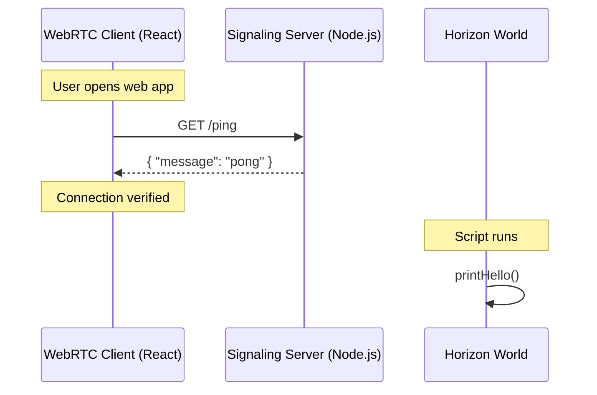

# Architecture Overview

This diagram illustrates the basic communication flow between the WebRTC Client and the Signaling Server.

## Components

1.  **WebRTC Client**: A React application that will eventually handle video/audio streaming.
2.  **Signaling Server**: A Node.js server to facilitate the initial connection between peers.
3.  **Horizon Scripts**: TypeScript code running within Meta Horizon Worlds to interface with the VR environment.
